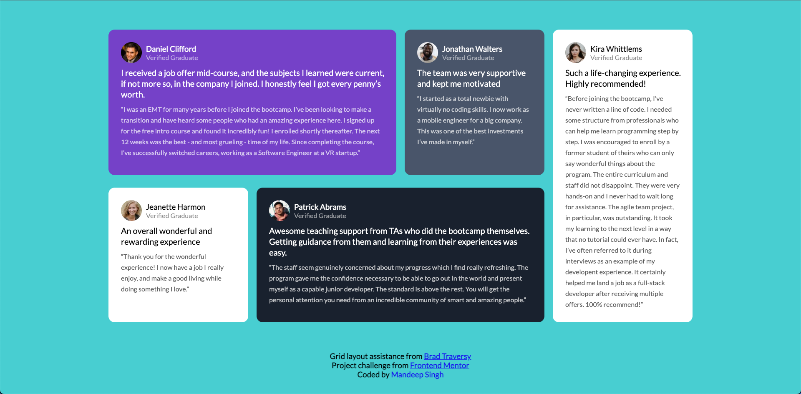

# **Learning CSS Grid**

## <ins>Summary</ins>

This is a web page built using CSS Grid as a challenge set by [Frontend Mentor](https://www.frontendmentor.io/challenges/testimonials-grid-section-Nnw6J7Un7). The grid layout assistance was provided by Brad Traversy's 'CSS Grid Crash Course' Youtube [video](https://youtu.be/0xMQfnTU6oo).

The purpose of this website was to allow me to build up a better understanding of grid and it's fundamentals and then apply it to a project.

---

## <ins>Screenshot</ins>

---

## <ins>Tech Stack</ins>

- HTML
- CSS
- Flexbox
- Grid

---

## <ins>Hosted Version</ins>

https://mandeep-s1ngh.github.io/learning-css-grid/

---

## <ins>Local Setup</ins>

This site uses HTML & CSS only so feel free to clone the repo and then explore & play around with the code.

1. To clone the repo, open up your terminal and run `git clone https://github.com/mandeep-s1ngh/learning-css-grid.git` - once you have it cloned, move the folder to your usual directory for projects (if necessary)

2. You can then open up the folder in your code editor of choice and work on the files.

**Tip** - If you use Visual Studio Code, I would recommend the [Live Server](https://marketplace.visualstudio.com/items?itemName=ritwickdey.LiveServer) extension which allows you to right click on the index.html file and open it with LiveServer so you can view the site in your browser. You can then make changes to the files and see the changes take effect without needing to refresh the page.
